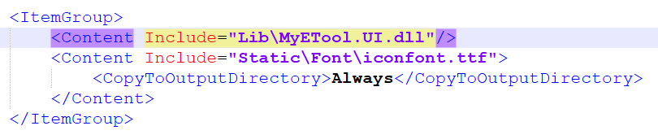

# MyETool.FloatWindow

> 基于 [MyETool.UI](https://github.com/bitmms/MyETool.UI) 中 **Icon** 组件实现的可交互异形悬浮窗

## 1. 引入 MyETool.UI 项目

> （1）引入 DLL 文件
>
> * 在 `MyETool.FloatWindow/Lib` 放置 MyETool.UI.dll 文件

> （2）引入资源字典

```xaml
<Application.Resources>
    <ResourceDictionary>
        <ResourceDictionary.MergedDictionaries>
            <ResourceDictionary Source="Pack://application:,,,/MyETool.UI;component/Themes/Generic.xaml" />
        </ResourceDictionary.MergedDictionaries>
    </ResourceDictionary>
</Application.Resources>
```

> （3）引入 ttf 字体文件
>
> * 位置：`MyETool.FloatWindow\Static\Font`
> * 类型：Content
> * 复制：始终复制

> （4）使用组件

```xaml
<Window x:Class="MyETool.FloatWindow.FloatBall"
        xmlns="http://schemas.microsoft.com/winfx/2006/xaml/presentation"
        xmlns:x="http://schemas.microsoft.com/winfx/2006/xaml"
        xmlns:mc="http://schemas.openxmlformats.org/markup-compatibility/2006"
        xmlns:d="http://schemas.microsoft.com/expression/blend/2008"
        xmlns:icon="clr-namespace:MyETool.UI.Components.IconComponent.Component;assembly=MyETool.UI"
        mc:Ignorable="d"
        Topmost="True"
        WindowStyle="None"
        AllowsTransparency="True"
        ShowInTaskbar="False"
        ResizeMode="NoResize"
        Title="MainWindow"
        Width="60"
        Height="60"
        Background="Transparent"
        Loaded="FloatBall_OnLoaded"
        MouseDown="OnMouseDown"
        MouseRightButtonDown="OnRightClick"
        MouseDoubleClick="OnDoubleClick">

    <Border>
        <icon:Icon
            IconSize="60"
            IconColor="#fed892"
            IconCode="&#xeaaf;"
            IconPath="pack://application:,,,/MyETool.FloatWindow;component/Static/Font/iconfont.ttf#iconfont" />
    </Border>

</Window>
```

## 2. 资源文件和 DLL 引入的注意事项

> 普通的资源文件
>
> * 类型：Content
> * 复制：始终复制
>
> 引入的 DLL 文件
>
> * 类型：Content
> * 复制：始终复制
> * 引入：引入 DLL 文件，在 MyETool.FloatWindow.csproj 文件中可知，引入 DLL 的操作是通过相对路径实现的


